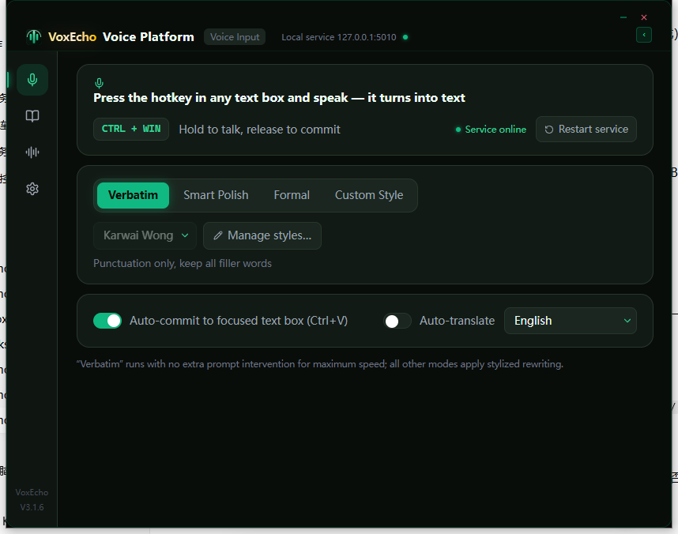

Languages: [English](README.md) | [简体中文](README_ZH.md) | [繁體中文](README_CHT.md)

---

# 🎙️ FewType — 语音打字、长文转语音与翻译桌面助手

一个免费的 Windows 桌面助手，集语音打字（STT）、长文本转语音（TTS）、翻译与电子书朗读于一体——基于 Tauri 重构。配套浏览器扩展为网页电子书阅读器（Google Play Books 与 Koodo Reader）提供高质量 TTS 朗读。

### ✨ 核心功能

- **语音打字 / 语音听写（STT）** — 按快捷键说话，文字直接落在光标所在处——任意窗口通用。逐字模式忠实记录你所说的内容，不经 LLM 改写。
- **翻译并上屏** — 确认原文、翻译、直接粘贴进任意窗口。支持可选翻译风格（如"王家卫"风格），翻译也可以有味道。
- **长文本转语音（TTS）** — 输入或粘贴长文本，逐行试听，生成自然神经语音，可导出音频文件。
- **电子书朗读** — 配套扩展为网页电子书阅读器提供自然 TTS 朗读：Google Play Books 与 Koodo Reader，支持自动翻页与文本高亮同步。
- **多服务商** — 火山引擎、Groq 等，STT / LLM / TTS 可选；网络好时用快的，不好时用稳的。
- **注重隐私** — 日志只记录错误，转写原文一律不落盘。

### 🖥️ 界面截图

### 🚀 快速开始

1. 从 [Releases](https://github.com/Ray1979ANYWAY/VoxEcho/releases) 下载最新安装版或便携版。
2. 运行 FewType，打开**设置**，填入服务商的 API Key。
3. 按下快捷键（可在设置中自定义——Ctrl+Win 或双击 Ctrl）说话，文字将输入到光标所在处。
4. 需要电子书朗读时，将 `FewType-extension` 文件夹作为"已解压的扩展程序"加载到 Chrome/Edge——不读电子书可跳过此步。

### 📦 技术栈

- **前端** — Tauri 2 + React + TypeScript + Tailwind
- **后端** — Python（PyInstaller 单文件），本地 HTTP 服务 `127.0.0.1:5010`
- **扩展** — Chrome Manifest V3，自动适配 bridge 端口 5005/5010

### 🌍 界面语言

English · 简体中文 · 繁體中文——首次启动跟随系统语言，其他语言一律英文兜底。

### ⚠️ 说明与能力边界

- 程序**未签名**——首次安装时 Windows SmartScreen 可能弹出警告，选择"更多信息 → 仍要运行"即可。
- 需要 **WebView2 运行时**（大多数 Windows 10/11 系统已预装）。
- 需要自备 **API Key**（STT / LLM 服务商）。
- 这是一个活跃维护的个人项目——能力可能随版本变化。Bug 与建议欢迎提交到 [Issues](https://github.com/Ray1979ANYWAY/VoxEcho/issues)。

### 🔒 安全与隐私

- **你的 API Key 与风格 Prompt 永不存放在程序目录**——统一保存在 `%APPDATA%\com.rayanyway.fewtype\bridge_config.json`。复制、压缩、移动程序文件夹（或本仓库）都不会带走任何密钥。
- 发布包**不含任何配置文件**；内置安全默认值，首次启动自动生成。
- 打包脚本若检测到配置文件会以系统语言弹出警告并中止，密钥不可能混入发布包。
- **卸载时自动删除应用数据（含 API Key）**。

### ☕ 支持项目

如果 FewType 对你有用，请考虑请我喝杯咖啡！

